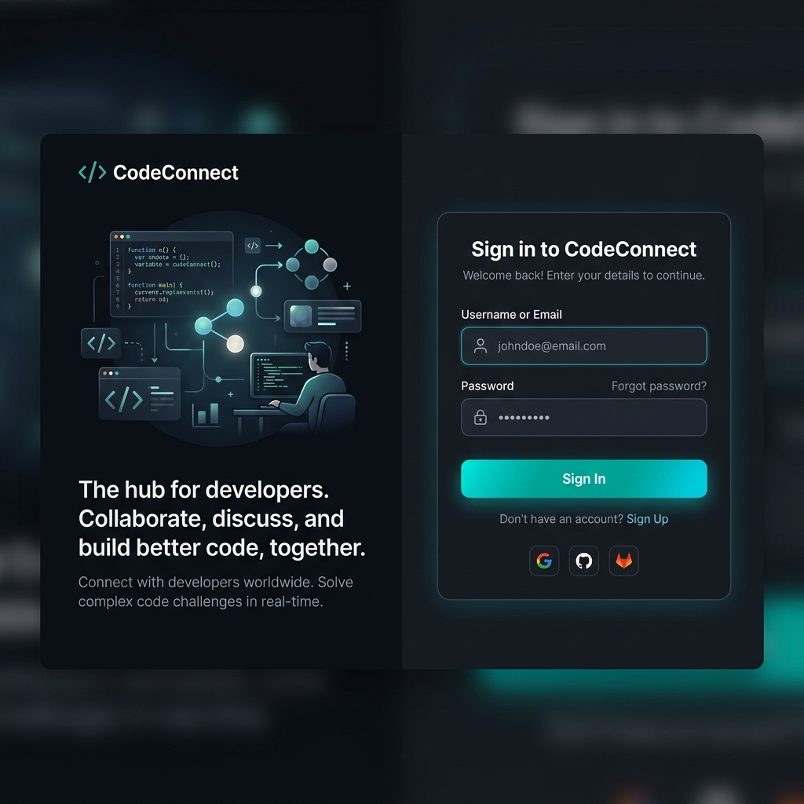
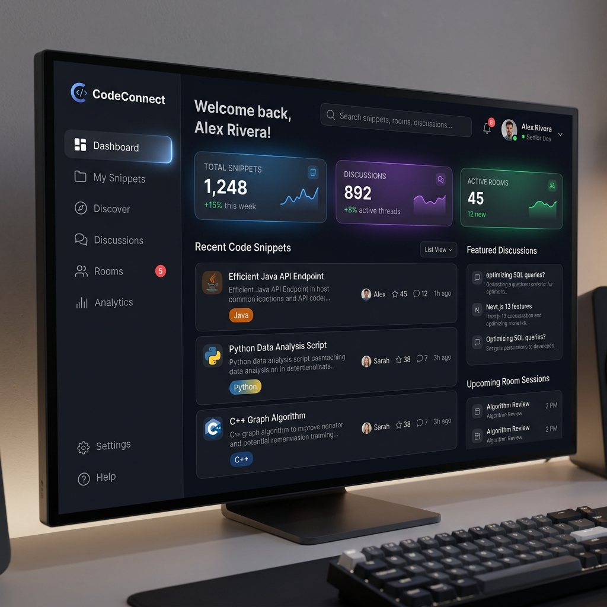
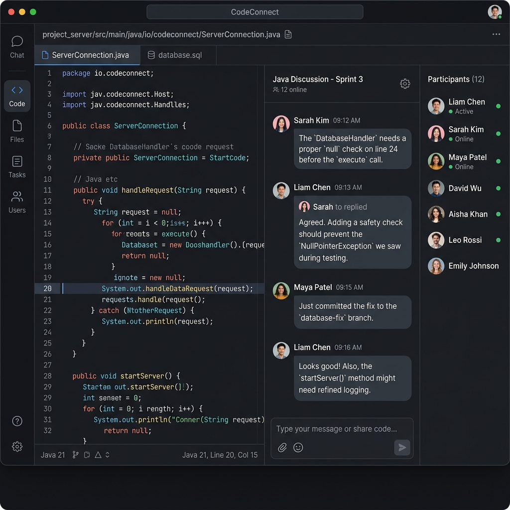

# CodeConnect

**Real-Time Collaborative Code Discussion Platform**
*Software Design and Analysis — Deliverables 1–5*
Abdullah Ismail (24i-0673) · Zulqarnain Zulfiqar (24i-0817)

---

## What it is

CodeConnect is a Java/JavaFX desktop app that puts your **code and your
conversation in the same window**. Upload a snippet, open its discussion
room, and chat with teammates in real time over Java sockets — backed by a
relational database via JDBC. No more flipping between IDE, Slack, and email
to explain one bug.

## Screenshots

### 1. Authentication Screen


### 2. Main Dashboard


### 3. Discussion Room & Code Editor


## Tech stack

| Layer | Choice |
|---|---|
| Language | **Java 21** (Compiler Source & Target) |
| GUI | **JavaFX 21** + RichTextFX (syntax highlight) + AtlantaFX |
| DB (default) | **SQLite** via JDBC (`jdbc:sqlite:codeconnect.db`) |
| DB (multi-PC) | **MySQL 8** via JDBC (env-driven, see below) |
| Real-time | **Java Sockets** (`SocketServer` facade over `LocalEventBus`) |
| Auth | **BCrypt** password hashing (`jbcrypt 0.4`) |
| Build | **Maven 3.9.6** (bundled) |
| Testing | **JUnit 5** (26 tests, all passing) |

## Quick start

### Single machine — zero setup

```powershell
cd CodeConnectProject
.\run.ps1
```

`run.ps1` downloads OpenJDK 21 + Maven on first run (~2 min), then compiles
and launches the app.

### Login

| User | Password | Role |
|---|---|---|
| `admin` | `admin` | Admin |
| `dev`   | `dev`   | Developer |

Or click **"Don't have an account? Register"** to create your own (auto-Developer).

### Two desktops on one LAN

See [`MULTI_DESKTOP_SETUP.md`](MULTI_DESKTOP_SETUP.md) — the short version is:

1. Install MySQL on a hub PC, create the `codeconnect` database.
2. Set six environment variables on both PCs (`DB_KIND=mysql`, `DB_URL=…`, etc.).
3. Open ports 3306 + 39817 in Windows Firewall on the hub.
4. Run `run.ps1` on both — the first one becomes the bus server, the second
   one connects.

## Architecture

```
com.codeconnect/
├── App.java                  # JavaFX entry point, splash, scene wiring
│
├── model/                    # Domain entities (Account hierarchy + POJOs)
│   ├── Account (abstract)    # id, username, password, login(), logout(), verifyPassword()
│   ├── User extends Account  # role, email, disabled
│   ├── Developer extends User, Admin extends User
│   ├── CodeSnippet           # owns formatSyntax()  (GRASP — Information Expert)
│   ├── DiscussionRoom        # owns createMessage()/saveRoom()/leaveRoom() (GRASP — Creator)
│   ├── Message, Session
│
├── controller/               # GRASP — Pure Fabrication
│   ├── AuthController        # UC-1, UC-2, UC-10
│   ├── SnippetController     # UC-3, UC-4, UC-9, UC-12
│   ├── DiscussionController  # UC-5, UC-6, UC-7, UC-8
│
├── dao/                      # JDBC persistence (1 class per table family)
│   ├── UserDAO, CodeSnippetDAO, DiscussionRoomDAO,
│   ├── MessageDAO, NotificationDAO, BookmarkDAO, DashboardDAO
│
├── db/                       # GRASP — Pure Fabrication
│   ├── DatabaseHelper        # backend selection + DDL + migrations
│   ├── DatabaseManager       # facade per DCD
│
├── net/                      # GRASP — Pure Fabrication
│   ├── LocalEventBus         # raw socket pub/sub (LAN-aware)
│   ├── SocketServer          # facade per DCD
│
└── ui/                       # JavaFX views (no JDBC, no controllers create entities)
    ├── AuthView, MainWindow, SidebarView, RightInsightView,
    ├── DashboardView, UploadView, DiscussionWindow, MyRoomsView,
    ├── ProfileView, AdminView, NotificationsView,
    ├── ViewCodeDialog, FxToast, SyntaxHighlighter
```

UI → Controller → DAO → DatabaseHelper → JDBC → SQLite/MySQL.
Controllers fan-out to `SocketServer` for real-time broadcast.

See [`TRACEABILITY.md`](TRACEABILITY.md) for the line-by-line mapping from
each Deliverable-3 use case and Deliverable-5 DCD class to the source file
that implements it.

## Tests

```powershell
.\run.ps1                  # downloads JDK + Maven
$env:JAVA_HOME = "$PWD\jdk-21.0.2"
$env:PATH      = "$env:JAVA_HOME\bin;$PWD\apache-maven-3.9.6\bin;" + $env:PATH
mvn test
```

Expected:

```
Tests run: 26, Failures: 0, Errors: 0, Skipped: 0
BUILD SUCCESS
```

Test coverage:

| File | What it covers |
|---|---|
| `AccountTest`            | DCD abstract class hierarchy, `verifyPassword()` (BCrypt + plaintext legacy) |
| `DiscussionRoomTest`     | GRASP-Creator behaviour of `createMessage()` |
| `AuthControllerTest`     | UC-1 register, UC-2 login, UC-10 logout, disabled-account flow, admin seeding |
| `SnippetControllerTest`  | UC-3 upload, UC-4 search, UC-9 moderation, charset validation, boundaries |
| `DiscussionControllerTest`| UC-5 join room, UC-7 message validation, conversation history boundaries |
| `UserDAOTest`            | hashing, duplicate detection, role updates |
| `CodeSnippetDAOTest`     | persistence round-trip + hidden flag |
| `NotificationDAOTest`    | insert + count unread + click-through metadata |

## Deliverable status

| # | Deliverable | Where to find it |
|---|---|---|
| D1/D2 | Project proposal | `backknowledge.txt`, `*.docx` in repo root |
| D3    | Use Case Modeling | 12 use cases — every flow is implemented and routed through the appropriate Controller (see `TRACEABILITY.md`) |
| D4    | Domain Model + 12 SSDs | Domain entities under `model/`, SSD events trace to system operations on the controllers |
| D5    | DCD + Sequence Diagrams | Abstract `Account` + Developer/Admin, three Pure-Fabrication controllers, `DatabaseManager` + `SocketServer` facades, GRASP-Creator on `DiscussionRoom`, GRASP-Information-Expert on `CodeSnippet.formatSyntax()` and `Account.verifyPassword()` |

## Out of scope (per spec)

- ❌ Video / voice calls
- ❌ Mobile application
- ❌ Cloud hosting
- ❌ AI features
- ❌ Large-scale deployment

## Repository layout

```
CodeConnectProject/
├── src/main/java/com/codeconnect/...        # 30 Java sources
├── src/main/resources/com/codeconnect/      # theme.css
├── src/test/java/com/codeconnect/...        # 8 test classes, 26 tests
├── pom.xml                                   # Maven build descriptor
├── run.ps1                                   # one-command bootstrap & launch
├── run.sh                                    # macOS/Linux clean run script
├── MULTI_DESKTOP_SETUP.md                    # MySQL + LAN bus walkthrough
├── TRACEABILITY.md                           # DCD/UC → source-file matrix
└── README.md                                 # this file
```
